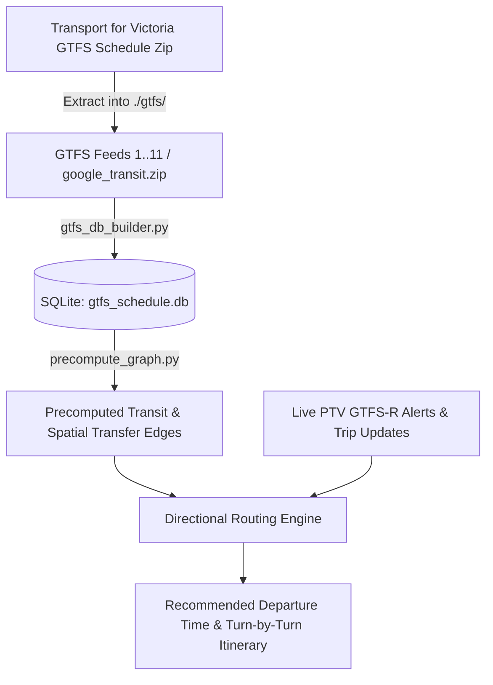

# Motion: Multi-Modal Transit Routing Engine

Motion is a high-performance, multi-modal transit routing and departure calculation engine for the Victorian Public Transport (PTV / Transport for Victoria) network. It supports backward timetable scheduling from a desired arrival time, spatial graph precomputation, directional A* heuristics, and live GTFS-Realtime (GTFS-R) disruption handling (including automated rail replacement bus injection vs alternative train line detour routing).

---

## Architecture & Data Pipeline



---

## 1. Prerequisites & Environment Setup

### 1.1 Conda Environment
Create and activate the conda environment using the provided [`environment.yml`](file:///Users/lucidmach/Motion/environment.yml):

```bash
conda env create -f environment.yml
conda activate motion
```

If the environment already exists, update it via:
```bash
conda env update -f environment.yml --prune
```

### 1.2 PTV & Mapbox Key Configuration
Create a `.env` file in the project root to configure live GTFS-Realtime queries and the Mapbox 3D map:

```bash
PTVOpenDataAPIKey=YOUR_PTV_API_KEY
PUBLIC_MAPBOX_TOKEN=pk.your_mapbox_token_here
```

### 1.3 Web UI (Astro + Mapbox 3D)
The user interface is located in the [`UI/`](file:///Users/lucidmach/Motion/UI) directory, built with **Astro** and managed via **pnpm**:

```bash
# Install UI dependencies
pnpm install

# Start development server (http://localhost:3000)
pnpm dev

# Build for production
pnpm build
```

---

## 2. Downloading GTFS Schedule Data

The static schedule timetable data is provided by the Victorian Department of Transport and Planning via DataVic:

🔗 **Download Page**: [Transport for Victoria GTFS Schedule Dataset](https://opendata.transport.vic.gov.au/dataset/gtfs-schedule)

### 2.1 Download Steps
1. Navigate to the [GTFS Schedule Dataset](https://opendata.transport.vic.gov.au/dataset/gtfs-schedule) page on the DataVic Open Data Portal.
2. Download the latest GTFS Schedule release archive (usually named `gtfs.zip` or full package).
3. Extract the contents into the `gtfs/` directory in the repository root.

### 2.2 Feed Directory Layout
After extraction, your `gtfs/` directory should follow this structure:

```
gtfs/
├── 1/   # Regional Train (V/Line Train)
│   └── google_transit.zip
├── 2/   # Metropolitan Train (Metro Trains Melbourne)
│   └── google_transit.zip
├── 3/   # Metropolitan Tram (Yarra Trams)
│   └── google_transit.zip
├── 4/   # Metropolitan Bus
│   └── google_transit.zip
├── 5/   # Regional Bus
│   └── google_transit.zip
├── 6/   # Regional Coach
│   └── google_transit.zip
├── 10/  # Interstate
│   └── google_transit.zip
└── 11/  # SkyBus
    └── google_transit.zip
```

> **Note**: Both `gtfs/` and `gtfs_schedule.db` are gitignored to avoid committing massive binaries.

---

## 3. Building `gtfs_schedule.db`

The database builder parses the GTFS feeds, normalizes timestamps into seconds past midnight (`arrival_time_secs`, `departure_time_secs`), and creates optimized B-tree indexes.

### 3.1 Build Full Production Database
To ingest all available GTFS transit modes:

```bash
python gtfs_db_builder/gtfs_db_builder.py ./gtfs/*/google_transit.zip
```

Or specify individual feeds explicitly:
```bash
python gtfs_db_builder/gtfs_db_builder.py \
  ./gtfs/1/google_transit.zip \
  ./gtfs/2/google_transit.zip \
  ./gtfs/3/google_transit.zip \
  ./gtfs/4/google_transit.zip \
  ./gtfs/5/google_transit.zip \
  ./gtfs/6/google_transit.zip \
  ./gtfs/10/google_transit.zip \
  ./gtfs/11/google_transit.zip
```

### 3.2 Quick / Minimal Build (Metro Train & Tram Only)
For faster local iteration and testing:
```bash
python gtfs_db_builder/gtfs_db_builder.py ./gtfs/2/google_transit.zip ./gtfs/3/google_transit.zip
```

### 3.3 Mock Dataset (Offline / Testing Mode)
If no GTFS zip files are supplied, the builder synthesizes a mock multi-modal network for development:
```bash
python gtfs_db_builder/gtfs_db_builder.py
```

---

## 4. Precomputing Transit & Transfer Spatial Graphs

After populating `gtfs_schedule.db`, precompute the transit route connection edges and KDTree spatial walking transfer pairs (within 500m) to enable sub-second routing:

```bash
python precompute_graph/precompute_graph.py
```

This populates two tables in `gtfs_schedule.db`:
- `transit_network_edges`: Average transit travel durations between consecutive stops.
- `transfer_edges`: Walking transfer connections between nearby stops computed via KDTree on a unit sphere.

---

## 5. Usage & Querying Routes

Use [`ptv_realtime/ptv_realtime.py`](file:///Users/lucidmach/Motion/ptv_realtime/ptv_realtime.py) to calculate recommended departures and itineraries:

### 5.1 Query with Target Arrival Time & Safety Buffer
```bash
python ptv_realtime/ptv_realtime.py \
  --start "Richmond" \
  --destination "Footscray" \
  --arrival-time "2026-08-20 09:15" \
  --buffer 10
```

### 5.2 Query with Unix Epoch Arrival Timestamp
```bash
python ptv_realtime/ptv_realtime.py \
  --start "Richmond" \
  --destination "Footscray" \
  --arrival-timestamp 1787219700 \
  --buffer 10
```

### 5.3 Simulate Disruption with Replacement Bus Preference
```bash
python ptv_realtime/ptv_realtime.py \
  --start "Richmond" \
  --destination "Footscray" \
  --arrival-time "09:15" \
  --disrupt-route "Sandringham"
```

### 5.4 Simulate Disruption with Rail Detour (No Replacement Bus)
```bash
python ptv_realtime/ptv_realtime.py \
  --start "Richmond" \
  --destination "Footscray" \
  --arrival-time "09:15" \
  --disrupt-route "Sandringham" \
  --no-replacement-bus
```

### 5.5 Offline Query (Skip Live GTFS-R API Calls)
```bash
python ptv_realtime/ptv_realtime.py \
  --start "Alan Finkel Building" \
  --destination "The Spot Building" \
  --arrival-time "10:00" \
  --no-live-alerts
```

---

## 6. Interactive 3D Web UI & Search Engine

The frontend located in [`UI/`](file:///Users/lucidmach/Motion/UI) provides an interactive 3D map interface:

- **Bottom Search Bar Island**: Glassmorphic search interface (`SearchBar.tsx`) with instant keyboard access (`Enter` to focus/search, `Esc` back/clear hierarchy, `↑/↓` arrow key option cycling).
- **Live Dynamic Geocoding**: Resolves university faculties, landmarks, and street addresses across Victoria in real time via **OpenStreetMap Nominatim** merged with over 27,000+ local **GTFS transit stops**.
- **100% Fixed WebGL 3D Target Dot**: Destination pin rendered natively in WebGL on the GPU with pulsing radar rings (`motion-search-target-core`), mathematically locked to map coordinates with zero drift during 360° orbit, pan, and tilt (0° to 85°).
- **Spatial Region Engine**: Real-time bounding box and proximity resolver displaying the active corridor (e.g., `Melbourne CBD`, `Monash Innovation Hub`, `Richmond Interchange`).

---

## 7. Running the Test Suite

[`run_tests.sh`](file:///Users/lucidmach/Motion/run_tests.sh) runs the full suite - dependency checks, GTFS database checks, every unit test file (`directional_routing`, `ptv_realtime`, `tests/test_api.py`), and the end-to-end CLI scenarios - in one pass:

```bash
./run_tests.sh
```

To run just the FastAPI backend suite on its own:
```bash
python -m unittest tests/test_api.py
```

```bash
# Frontend Astro/React production build
cd UI && pnpm build
```

This verifies:
1. Python dependencies (`sqlite3`, `fastapi`, `networkx`, `geopy`, `scipy`).
2. GTFS SQLite database tables, stops, routes, and transfer edges.
3. Directional routing, PTV realtime parsing, and the FastAPI backend's HTTP surface.
4. Geometry, bearing calculations, and arrival timestamp parsing.
5. End-to-end multi-modal routing scenarios with live disruptions and detours.

---

## 8. Project Structure

```
.
├── directional_routing/        # Spatial graph traversal & directional A* engine
│   ├── directional_routing.py
│   ├── directional_routing.spec.md
│   └── test_directional_routing.py
├── gtfs/                       # Raw GTFS schedule archives (gitignored)
│   ├── 1..11/google_transit.zip
├── gtfs_db_builder/            # Relational SQLite ingestion pipeline
│   ├── gtfs_db_builder.py
│   └── gtfs_db_builder.spec.md
├── precompute_graph/           # KDTree spatial & transit edge precomputation
│   ├── precompute_graph.py
│   └── precompute_graph.spec.md
├── server/                     # FastAPI backend server
│   ├── main.py
│   ├── models/schemas.py       # Pydantic schemas (StopSearchResult, RoutePlan)
│   └── routes/stops.py         # Search & nearby endpoints with OSM Nominatim
├── tests/                      # Pytest suite
│   └── test_api.py
├── UI/                         # Astro 5 + React 19 + Mapbox 3D Geolocation Frontend
│   ├── src/components/         # HeaderHUD, SearchBar, MapboxMap, TokenModal
│   ├── src/scripts/map/        # MotionMapController, WebGL Search Marker, Region Resolver
│   ├── src/services/api.ts     # Client API with live OSM Nominatim & offline fallbacks
│   └── ARCHITECTURE.md         # UI Architecture & Event Bus Specification
├── CHANGELOG.md                # Project version history & UI changelog
├── environment.yml             # Conda environment definition
├── gtfs_schedule.db            # SQLite database (gitignored)
├── run_tests.sh                # End-to-end test runner script
└── README.md                   # Project documentation
```
