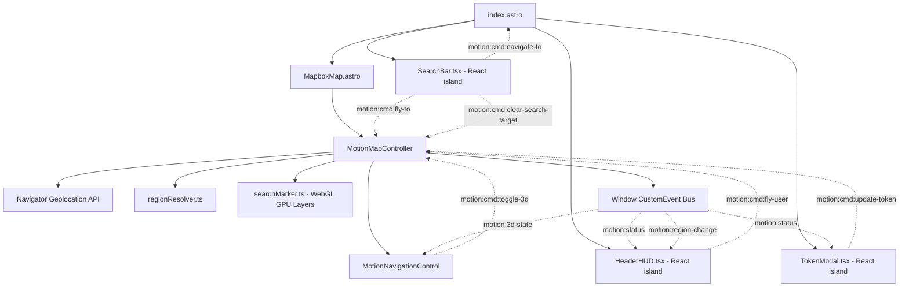

# Motion UI — Architecture

Cross-cutting reference: system shape, design tokens, and the `window` event bus. Per-component behavior lives next to each component in a `*.spec.md` file — see the links in §4.

## 1. Overview

The Motion frontend is a reactive, glassmorphic 3D web application for Victorian multi-modal transit visualization, spatial orientation, and live GPS geolocation. It's built on **Astro 5**, **React 19** (for stateful UI islands), **Tailwind CSS v4**, and **Mapbox GL JS v3**, connected by a decoupled `window` `CustomEvent` bus.

## 2. System architecture



## 3. Design system tokens

Defined in `src/styles/global.css` via Tailwind v4's `@theme` (generates `bg-*`/`text-*`/`border-*`/`font-*` utilities directly — no separate token lookup needed in components).

### 3.1 Color palette
| Utility prefix | Value | Usage |
| :--- | :--- | :--- |
| `deep` | `#05070d` | Base background behind canvas |
| `surface` | `rgba(10, 15, 29, 0.78)` | Floating panels, navigation bars |
| `surface-elevated` | `rgba(16, 24, 46, 0.85)` | Modals, active buttons, dropdowns |
| `surface-hover` | `rgba(28, 41, 75, 0.90)` | Interactive button hover states |
| `subtle` / `glow` / `active` | see `global.css` | Border colors (default / focus-glow / active) |
| `accent-cyan` | `#38bdf8` | Primary active accent, 3D highlights |
| `accent-indigo` | `#6366f1` | Secondary gradient accent |
| `accent-amber` | `#f59e0b` | GPS acquiring & fallback status |
| `accent-emerald` | `#10b981` | High precision lock status |

### 3.2 Typography
| Utility | Family | Fallbacks |
| :--- | :--- | :--- |
| `font-display` | `'Outfit'` | `-apple-system, BlinkMacSystemFont, sans-serif` |
| `font-sans` | `'Plus Jakarta Sans'` | `-apple-system, BlinkMacSystemFont, sans-serif` |
| `font-mono` | `'JetBrains Mono'` | `monospace` |

## 4. Component reference

| Component | Kind | Spec |
| :--- | :--- | :--- |
| `HeaderHUD` | React island | [`src/components/HeaderHUD/HeaderHUD.spec.md`](src/components/HeaderHUD/HeaderHUD.spec.md) |
| `TokenModal` | React island | [`src/components/TokenModal/TokenModal.spec.md`](src/components/TokenModal/TokenModal.spec.md) |
| `SearchBar` | React island | [`src/components/SearchBar/SearchBar.spec.md`](src/components/SearchBar/SearchBar.spec.md) |
| `MapboxMap` | Astro (imperative canvas) | [`src/components/MapboxMap.spec.md`](src/components/MapboxMap.spec.md) |
| `MotionNavigationControl` | Mapbox `IControl` (vanilla) | [`src/scripts/map/MotionNavigationControl.spec.md`](src/scripts/map/MotionNavigationControl.spec.md) |

## 5. Event bus specification (`window.dispatchEvent`)

Shared types live in `src/types/events.ts`.

### 5.1 Status & telemetry events (map → UI)

#### `motion:status`
```typescript
interface StatusEventDetail {
  state: 'ready' | 'needs_token' | 'gps_acquiring' | 'gps_active' | 'gps_fallback' | 'gps_unsupported' | 'error';
  message: string;
}
```

#### `motion:region-change`
```typescript
interface RegionChangeEventDetail { regionName: string; }
```

#### `motion:3d-state`
```typescript
interface PerspectiveEventDetail { is3D: boolean; }
```

#### `motion:location`
```typescript
interface LocationTelemetry {
  latitude: number;
  longitude: number;
  accuracy: number;
  altitude: number | null;
  altitudeAccuracy: number | null;
  heading: number | null;
  speed: number | null;   // km/h
  timestamp: number;
  source: 'gps' | 'preset' | 'default';
  locationName?: string;
}
```

### 5.2 Command events (UI → map)

| Command Event | Payload (`detail`) | Description |
| :--- | :--- | :--- |
| `motion:cmd:fly-user` | none | Flies camera to the user's current GPS position |
| `motion:cmd:fly-to` | `{ coords: [lon, lat], zoom?, pitch?, title?, subtitle? }` | Flies camera to target coordinates & places native WebGL target dot |
| `motion:cmd:clear-search-target` | none | Immediately unmounts & removes the WebGL 3D target dot pin from the map |
| `motion:cmd:navigate-to` | `{ stop_id, stop_name, stop_lat, stop_lon, mode? }` | Dispatches destination details to initiate navigation routing |
| `motion:cmd:toggle-3d` | none | Toggles between 3D oblique and 2D nadir perspective |
| `motion:cmd:set-3d` | `{ is3D: boolean }` | Explicitly switches perspective mode |
| `motion:cmd:update-token` | `{ token: string }` | Updates and saves the Mapbox access token |
| `motion:cmd:open-token-modal` | none | Triggers the token setup dialog |

> Removed from this surface: `motion:cmd:fly-hub`, `motion:cmd:light-preset`, `motion:cmd:reset-north` — these had listeners in the old `mapController.ts` but no UI ever dispatched them (dead code, removed during the React/Tailwind migration). Re-add alongside whatever UI element is meant to trigger them.

## 6. Responsive breakpoints

| Breakpoint | Target devices | Layout adaptations |
| :--- | :--- | :--- |
| `> 768px` | Desktop / Tablet Landscape | Full header HUD with complete region name, accuracy text |
| `480px – 768px` | Tablet Portrait / Mobile | Compact padding, truncated region label |
| `< 480px` | Small Mobile Phones | Brand subtitle hidden; GPS accuracy remains visible |
