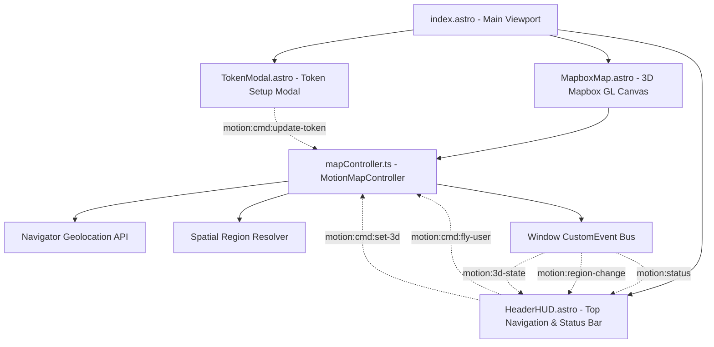

# UI Component Specification Sheet

## Overview

The Motion frontend is a reactive, glassmorphic 3D web application designed for Victorian multi-modal transit visualization, real-time spatial orientation, and live GPS geolocation. It leverages **Astro 5**, **Mapbox GL JS v3**, and a decoupled custom event bus for zero-dependency high-performance UI state management.

---

## 1. System Architecture & Component Hierarchy



---

## 2. Design System Tokens & Aesthetics

The UI implements a dark "Motion" aesthetic featuring deep void backgrounds, cyan and indigo atmospheric accents, and backdrop glassmorphism.

### 2.1 Color Palette
| Token | CSS Variable | Value | Usage |
| :--- | :--- | :--- | :--- |
| **Deep Void** | `--bg-deep` | `#05070d` | Base background behind canvas |
| **Glass Surface** | `--bg-surface` | `rgba(10, 15, 29, 0.78)` | Floating panels, navigation bars |
| **Elevated Surface**| `--bg-surface-elevated`| `rgba(16, 24, 46, 0.85)`| Modals, active buttons, dropdowns |
| **Hover Surface** | `--bg-surface-hover` | `rgba(28, 41, 75, 0.90)` | Interactive button hover states |
| **Cyan Glow** | `--accent-cyan` | `#38bdf8` | Primary active accent, 3D highlights |
| **Indigo Accent** | `--accent-indigo` | `#6366f1` | Secondary gradient accent |
| **Amber Warning** | `--accent-amber` | `#f59e0b` | GPS acquiring & fallback status |
| **Emerald Status** | `--accent-emerald` | `#10b981` | High precision lock status |

### 2.2 Typography Tokens
| Role | Family | Fallbacks |
| :--- | :--- | :--- |
| **Display / Brand** | `'Outfit'` | `-apple-system, BlinkMacSystemFont, sans-serif` |
| **Body / UI** | `'Plus Jakarta Sans'` | `-apple-system, BlinkMacSystemFont, sans-serif` |
| **Coordinates / Metrics** | `'JetBrains Mono'` | `monospace` |

---

## 3. Event Bus Specification (`Window.dispatchEvent`)

The application decouples presentation components from the 3D map engine using standard, typed DOM `CustomEvent`s dispatched on the global `window` object.

### 3.1 Status & Telemetry Events (Map -> UI)

#### `motion:status`
Dispatched when map engine or GPS connection status changes.
```typescript
interface StatusEventDetail {
  state: 'ready' | 'needs_token' | 'gps_acquiring' | 'gps_active' | 'gps_fallback' | 'gps_unsupported' | 'error';
  message: string; // e.g. "GPS Accuracy: ±12m" or "GPS Accuracy: Acquiring..."
}
```

#### `motion:region-change`
Dispatched when map center moves into a new Victorian spatial region or precinct.
```typescript
interface RegionChangeEventDetail {
  regionName: string; // e.g. "Melbourne CBD • Victoria" or "Southbank • Arts Precinct"
}
```

#### `motion:3d-state`
Dispatched when the camera perspective state transitions between 3D and 2D.
```typescript
interface PerspectiveEventDetail {
  is3D: boolean;
}
```

#### `motion:location`
Dispatched on continuous GPS geolocation position updates.
```typescript
interface LocationTelemetry {
  latitude: number;
  longitude: number;
  accuracy: number;        // In meters (±Xm)
  altitude: number | null;
  altitudeAccuracy: number | null;
  heading: number | null;
  speed: number | null;   // Converted to km/h
  timestamp: number;
  source: 'gps' | 'preset' | 'default';
}
```

### 3.2 Command Events (UI -> Map)

| Command Event | Payload (`detail`) | Description |
| :--- | :--- | :--- |
| `motion:cmd:fly-user` | `none` | Smoothly flies camera to user's current GPS position |
| `motion:cmd:toggle-3d` | `none` | Toggles between 3D oblique and 2D nadir perspective |
| `motion:cmd:set-3d` | `{ is3D: boolean }` | Explicitly switches perspective mode |
| `motion:cmd:fly-hub` | `{ hub: string }` | Flies to preset transit hub (e.g. `'flinders'`) |
| `motion:cmd:reset-north` | `none` | Resets bearing to true North (0°) |
| `motion:cmd:update-token`| `{ token: string }` | Updates and saves Mapbox Access Token |
| `motion:cmd:open-token-modal` | `none` | Triggers token setup dialog |

---

## 4. Component Reference

### 4.1 `HeaderHUD.astro`
The top navigation bar positioned at `top: 20px`. Houses branding, dynamic spatial region detection, and primary navigation actions.

#### DOM Structure
- **`.brand-group`**:
  - Logo icon with floating pulse animation.
  - Brand Title: `MOTION` (gradient display text).
  - Dynamic Region Subtitle: `<span id="region-focus-label">` listening to `motion:region-change`.
- **`.header-actions`**:
  - **GPS Recenter Button** (`#btn-gps-recenter`): Displays pulsating status dot and `"GPS Accuracy: ±Xm"`. Dispatches `motion:cmd:fly-user` on click.
  - **2D / 3D Segmented Switch** (`.perspective-switcher`): Houses `#btn-switch-2d` and `#btn-switch-3d` tabs. Emits `motion:cmd:set-3d` and listens to `motion:3d-state`.

#### Styling & Accessibility
- Semi-transparent glassmorphic container with `backdrop-filter: blur(16px)`.
- `aria-label="Navigation & Region Status Bar"` for screen readers.
- `aria-pressed="true|false"` on 2D/3D switch tabs.
- Smooth CSS text-change transition when the active region changes.

---

### 4.2 `MapboxMap.astro`
The 3D Mapbox GL JS container and lifecycle coordinator.

#### Props
| Prop | Type | Default | Description |
| :--- | :--- | :--- | :--- |
| `initialToken` | `string` | `import.meta.env.PUBLIC_MAPBOX_TOKEN` | Initial Mapbox access token |

#### DOM Structure
- `<div id="map">`: Full-viewport canvas container (`width: 100vw; height: 100vh;`).

#### Controller Coordination
- Initializes `MotionMapController` upon DOM ready.
- Subscribes to all `motion:cmd:*` command events.
- Safely cleans up geolocation watch subscriptions and WebGL contexts on page unload.

---

### 4.3 `TokenModal.astro`
An accessible setup dialog for entering the Mapbox Public Access Token (`pk.eyJ...`).

#### Key Features
- Automatically appears when `motion:status` reports `needs_token` or token authorization fails (HTTP 401/403).
- Saves token to `localStorage.getItem('motion_mapbox_token')`.
- Supports keyboard shortcuts (`Enter` to submit, `Escape` to close).
- Backing blur backdrop (`backdrop-filter: blur(8px)`).

---

### 4.4 `mapController.ts` (`MotionMapController`)
The central TypeScript controller managing Mapbox GL JS instances, 3D standard styling, camera animations, and geolocation telemetry.

#### Spatial Region Resolution (`resolveRegionInFocus`)
Detects active regions based on viewport coordinates and zoom level:

```typescript
export function resolveRegionInFocus(lng: number, lat: number, zoom: number): string
```

1. **Zoom-Level Stratification**:
   - `zoom < 9.0`: Victoria State Wide (`"Victoria • Regional Transit Network"`).
   - `9.0 <= zoom < 11.8`: Metropolitan / Regional corridor resolution.
   - `zoom >= 11.8`: Precision precinct & station bounding box and centroid proximity matching.
2. **Supported Region Zones**:
   - Flinders St Station & Melbourne CBD Core
   - Melbourne Central & City Loop
   - Southern Cross Regional Terminal
   - Southbank & Arts Precinct
   - Docklands & Victoria Harbour
   - Carlton & University Precinct
   - Parkville Biomedical & Health Hub
   - East Melbourne, Olympic & MCG
   - Richmond Transit Interchange
   - South Yarra & Chapel Street
   - St Kilda & Port Phillip Foreshore
   - Fitzroy & Collingwood Inner North
   - Footscray Western Transit Hub
   - North Melbourne & Arden Corridor
   - Box Hill Eastern Transit Hub
   - Clayton & Monash Innovation Hub
   - Ringwood Maroondah Interchange
   - Dandenong South-East Transit Hub
   - Frankston Mornington Gateway
   - Geelong Regional Transit Corridor
   - Ballarat Goldfields Regional Hub
   - Bendigo Loddon Campaspe Hub
   - Melbourne Airport SkyBus Terminal

---

## 5. Responsive Breakpoints

| Breakpoint | Target Devices | Layout Adaptations |
| :--- | :--- | :--- |
| `> 768px` | Desktop / Tablet Landscape | Full header HUD with complete region name, accuracy text, and 2D/3D toggle |
| `480px - 768px`| Tablet Portrait / Mobile | Compact padding, truncated region label, simplified button text |
| `< 480px` | Small Mobile Phones | Subtitle hidden to prevent brand overflow; GPS accuracy and 2D/3D switches remain fully interactive |
