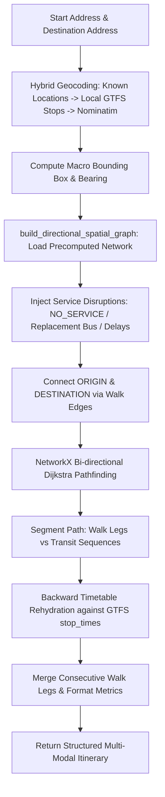

# Technical Specification: Directional Multi-Modal Routing Engine

## Overview
`directional_routing.py` is an advanced transit routing engine designed for reverse-chronological (target-arrival-driven) journey planning. Given an **Origin**, a **Destination**, a **Target Arrival Time**, and optional **Disruption Profiles**, it computes the optimal multi-modal travel itinerary.

The engine integrates precomputed static GTFS transit networks with transfer walking graphs, in-memory dynamic disruption injection (including rail replacement buses and detours), and bi-directional Dijkstra pathfinding coupled with backward timetable rehydration.

---

## Key Architecture & Design Decisions



### 1. Reverse-Chronological Planning (Target Arrival Time)
Unlike conventional departure-first routing engines, `directional_routing.py` routes backwards from the user's required destination arrival deadline ($T_{\text{target}}$) to deduce the latest possible departure time while optimizing total in-vehicle time and minimizing transfers.

### 2. Dynamic In-Memory Disruption Adaptation
Rather than modifying persistent disk databases or invalidating precomputed cache tables, disruptions are applied directly to the in-memory NetworkX spatial graph during path construction:
- **`NO_SERVICE` with Replacement Bus**: Replaces the disrupted transit edge with a road-based replacement bus edge ($28\text{ km/h} + 1\text{ min}$ dwell per stop).
- **`NO_SERVICE` without Replacement Bus**: Prunes the edge completely, forcing Dijkstra to find an alternative line or transfer detour.
- **`DELAYED`**: Adds delay minutes directly to edge traversal weights.

### 3. Transfer Penalty & Station Platform Unification
- Inter-station walking transfers include a fixed `TRANSFER_PENALTY_MINS = 7.0` penalty to discourage unnecessary transfers.
- Timetable rehydration unifies platforms by stop name (e.g. Flinders Street Platforms 1–14) to prevent platform-specific routing failures.

---

## Configuration & Constants

| Constant | Value | Description |
| :--- | :--- | :--- |
| `DB_NAME` | `'gtfs_schedule.db'` | Path to SQLite GTFS relational database |
| `WALKING_SPEED_KMH` | `5.0` | Assumed pedestrian walking velocity (km/h) |
| `TRANSFER_PENALTY_MINS` | `7.0` | Virtual cost added to transfer edges to penalize line changes |
| `REPLACEMENT_BUS_SPEED_KMH` | `28.0` | Estimated average travel speed for replacement buses |
| `REPLACEMENT_BUS_DWELL_MINS` | `1.0` | Added dwell time per station stop for replacement buses |
| `KNOWN_LOCATIONS` | `dict[str, (lat, lon)]` | Offline coordinates for major landmarks, campuses, and hub stations |

---

## Core API & Function Reference

### 1. `calculate_directional_itinerary(...)`
The primary public entry point for calculating end-to-end multi-modal itineraries.

```python
def calculate_directional_itinerary(
    start_address: str,
    dest_address: str,
    arrival_dt: datetime,
    db_path: str = DB_NAME,
    disruptions: list = None,
    cancelled_routes: list = None,
    cancelled_trips: list = None,
    prefer_replacement_bus: bool = True
) -> dict
```

#### Parameters
| Parameter | Type | Default | Description |
| :--- | :--- | :--- | :--- |
| `start_address` | `str` | *Required* | Origin location name, stop name, or address |
| `dest_address` | `str` | *Required* | Destination location name, stop name, or address |
| `arrival_dt` | `datetime` | *Required* | Target arrival deadline as a `datetime` object |
| `db_path` | `str` | `'gtfs_schedule.db'` | Path to the GTFS SQLite database file |
| `disruptions` | `list[dict\|str]` | `None` | Active disruption specifications or route names |
| `cancelled_routes`| `list[str]` | `None` | Route short names to exclude from routing |
| `cancelled_trips` | `list[str]` | `None` | Specific GTFS `trip_id`s to exclude from rehydration |
| `prefer_replacement_bus` | `bool` | `True` | Whether to allow replacement buses or detour via rail/tram |

#### Return Schema
```json
{
  "status": "Success",
  "total_travel_time_mins": 33,
  "latest_departure_time": "08:41",
  "computation_time_secs": 0.545,
  "legs": [
    {
      "type": "WALK",
      "mode": "Walk",
      "instruction": "Walk 0.01km to Richmond Station",
      "duration_mins": 1,
      "start_time": "08:41",
      "end_time": "08:42",
      "from_stop": "Richmond",
      "to_stop": "Richmond Station"
    },
    {
      "type": "TRANSIT",
      "mode": "Train",
      "route": "Frankston",
      "instruction": "Take Train Frankston from Richmond Station to Flinders Street Station (13 mins, 1 stop)",
      "duration_mins": 13,
      "start_time": "08:42",
      "end_time": "08:55",
      "trip_id": "1234.T0.9-FS-...",
      "stops_count": 1,
      "from_stop": "Richmond Station",
      "to_stop": "Flinders Street Station",
      "is_replacement": false
    }
  ],
  "route": ["Richmond", "Richmond Station", "Flinders Street Station", "Footscray Station", "Footscray"],
  "modes_used": ["Walk", "Train", "Train", "Walk"],
  "modes_summary": "Walk -> Train -> Train -> Walk",
  "transfers_count": 1,
  "disruptions_applied": [...],
  "replacement_buses_used": false
}
```

---

### 2. `geocode_address(address, db_path)`
Resolves text queries or coordinate strings into `(latitude, longitude)` coordinates using a 4-tier strategy:
1. **Direct Coordinate Fast-Path**: Parses `"lat,lon"` numeric string inputs immediately without database or network latency.
2. **Offline Dictionary Lookup**: Matches normalized text against `KNOWN_LOCATIONS`.
3. **Local GTFS Stop Database**: Matches against `stops` table via `stop_name LIKE %address%`.
4. **Online Nominatim Fallback**: Queries OpenStreetMap Nominatim service with automatic timeout handling.

---

### 3. Spatial & Geometric Utilities
- **`haversine(lat1, lon1, lat2, lon2) -> float`**: Calculates great-circle distance in kilometers.
- **`calculate_bearing(lat1, lon1, lat2, lon2) -> float`**: Computes forward compass azimuth in degrees ($0^{\circ}-360^{\circ}$).
- **`get_angle_diff(angle1, angle2) -> float`**: Computes minimal angular delta ($0^{\circ}-180^{\circ}$).
- **`walking_time_mins(distance_km) -> float`**: Converts pedestrian distance to minutes at $5\text{ km/h}$.
- **`get_mode_name(route_type) -> str`**: Maps GTFS standard (0=Tram, 1/2=Train, 3=Bus, 4=Ferry) and extended Hierarchical Route Types (HVT) into readable mode labels.

---

### 4. Graph Construction & Rehydration

#### `build_directional_spatial_graph(...)`
- Constructs a corridor-bounded `nx.DiGraph`.
- Loads nodes from `stops` within an origin-destination bounding box (padded by $\pm 0.06^\circ$).
- Ingests edges from `transit_network_edges` and `transfer_edges`.
- Applies disruption overrides and rail replacement bus edge generation.

#### `get_latest_transit_leg_backward(conn, start_stop_id, end_stop_id, target_arrival_secs, ...)`
- Queries `stop_times`, `trips`, and `routes` for the latest service arriving at or before `target_arrival_secs`.
- Performs fallback matching across all platform stop IDs sharing the same station name.
- Enforces active cancellation filters on `trip_id` and `route_short_name`.

---

## Disruption Schema & Matching Specification

Disruptions can be passed as route name strings (e.g. `"Sandringham"`) or structured dictionaries:

```json
{
  "route_name": "Sandringham",
  "effect": "NO_SERVICE",
  "replacement_bus_available": true,
  "from_stop": "Richmond Station",
  "to_stop": "Flinders Street Station",
  "replacement_speed_kmh": 28.0,
  "replacement_dwell_mins": 1.0,
  "delay_mins": 15.0,
  "description": "Buses replace trains between Richmond and Flinders Street."
}
```

---

## Performance Characteristics
- **Graph Building**: $\approx 100\text{ ms}$ (utilizing indexed SQLite precomputed tables).
- **Bi-directional Dijkstra Search**: $\approx 20\text{ ms}$.
- **Timetable Backward Rehydration**: $\approx 50-100\text{ ms}$.
- **Total End-to-End Execution Time**: $0.3\text{ s} - 0.8\text{ s}$.
