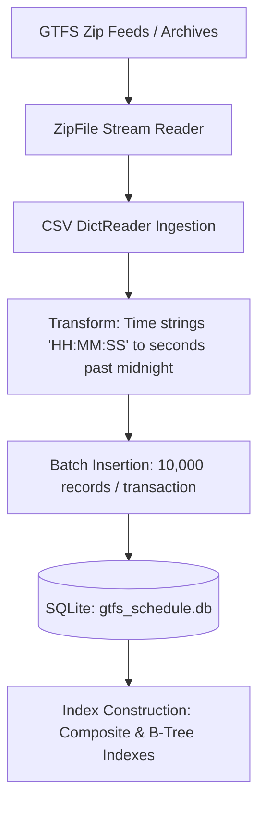

# Technical Specification: GTFS Database Builder

## Overview
`gtfs_db_builder.py` is the data ingestion and relational persistence pipeline for the transit routing engine. It reads one or more GTFS (General Transit Feed Specification) `.zip` archives or directories, parses transit feed files, normalizes temporal representations into seconds past midnight, loads data into an optimized SQLite database (`gtfs_schedule.db`), and builds database indexes for sub-second query performance.

It also includes a built-in mock GTFS generator for unit testing and offline development.

---

## Ingestion Architecture & Data Pipeline



### Key Capabilities
1. **Multi-Feed Ingestion**: Processes multiple GTFS zip feeds sequentially (e.g. Victorian Train, Tram, Metro Bus, Regional Coach feeds) into a unified relational database.
2. **Pre-converted Timestamps**: Converts `HH:MM:SS` strings (including transit times $\ge 24\text{ hours}$ for post-midnight trips) to integer seconds past midnight (`arrival_time_secs`, `departure_time_secs`) for indexable integer range comparisons.
3. **High-Throughput Batch Processing**: Uses 10,000-row chunks with `executemany` and `INSERT OR IGNORE` to prevent primary key collision aborts.
4. **Mock Feed Synthesis**: Automatically constructs a minimal multi-modal GTFS dataset with trains, buses, and scheduled transfers when no external zip archives are supplied.

---

## Database Schema Reference

The database initializes 6 core relational tables:

```sql
CREATE TABLE stops (
    stop_id TEXT PRIMARY KEY,
    stop_name TEXT,
    stop_lat REAL,
    stop_lon REAL,
    location_type INTEGER,
    parent_station TEXT
);

CREATE TABLE routes (
    route_id TEXT PRIMARY KEY,
    route_short_name TEXT,
    route_long_name TEXT,
    route_type INTEGER
);

CREATE TABLE trips (
    route_id TEXT,
    service_id TEXT,
    trip_id TEXT PRIMARY KEY,
    direction_id INTEGER
);

CREATE TABLE stop_times (
    trip_id TEXT,
    arrival_time TEXT,
    departure_time TEXT,
    stop_id TEXT,
    stop_sequence INTEGER,
    arrival_time_secs INTEGER,
    departure_time_secs INTEGER
);

CREATE TABLE calendar (
    service_id TEXT PRIMARY KEY,
    monday INTEGER,
    tuesday INTEGER,
    wednesday INTEGER,
    thursday INTEGER,
    friday INTEGER,
    saturday INTEGER,
    sunday INTEGER,
    start_date TEXT,
    end_date TEXT
);

CREATE TABLE calendar_dates (
    service_id TEXT,
    date TEXT,
    exception_type INTEGER
);
```

---

## Database Indexes

To accelerate spatial lookups, trip sequence joins, and backward timetable rehydration, the following B-Tree indexes are created after data loading:

| Index Name | Table | Indexed Columns | Purpose |
| :--- | :--- | :--- | :--- |
| `idx_stop_times_stop` | `stop_times` | `stop_id` | Quick retrieval of stop times by stop |
| `idx_stop_times_trip` | `stop_times` | `trip_id` | Join between `trips` and `stop_times` |
| `idx_stop_times_arr_secs` | `stop_times` | `arrival_time_secs` | Time-window range filtering |
| `idx_trips_route` | `trips` | `route_id` | Fast join from `trips` to `routes` |
| `idx_trips_service` | `trips` | `service_id` | Service day & calendar validation |
| `idx_stops_lat_lon` | `stops` | `stop_lat, stop_lon` | Bounding-box spatial queries |

---

## Core Functions & API

### 1. `build_db_from_zips(zip_paths, db_path=DB_NAME)`
Constructs or replaces the SQLite GTFS database from a collection of zip archives.

#### Parameters
- `zip_paths` (*list[str]*): List of file paths to GTFS `.zip` archives.
- `db_path` (*str*, default: `'gtfs_schedule.db'`): Destination SQLite database file path.

#### Processing Steps
1. Drops and recreates the target database schema via `init_db(conn)`.
2. Iterates over each archive and imports `stops.txt`, `routes.txt`, `trips.txt`, `stop_times.txt`, `calendar.txt`, and `calendar_dates.txt`.
3. Runs `time_to_secs` transformations on `stop_times` arrival and departure fields.
4. Builds performance indexes and commits transaction.

---

### 2. `time_to_secs(time_str: str) -> int`
Parses a `HH:MM:SS` time string into integer seconds past midnight.

- **Example**: `"08:30:00"` $\rightarrow 30600$
- **Post-Midnight Trips**: `"25:15:00"` $\rightarrow 90900$ (handles GTFS standard multi-day service numbering)
- **Invalid / Null Input**: Returns `-1`.

---

### 3. `import_csv_to_table(conn, table_name, csv_file_obj, expected_columns, transform_func=None)`
High-efficiency streaming CSV reader and batch database writer.

- **Encoding**: Reads with `utf-8-sig` to automatically strip UTF-8 Byte Order Marks (BOM).
- **Chunk Size**: 10,000 records per transaction.
- **Conflict Handling**: Employs `INSERT OR IGNORE`.

---

### 4. `build_mock_gtfs() -> str`
Creates an in-memory / temporary directory GTFS package with predefined train (`R1`) and bus (`R2`) services for test execution without requiring production data feeds. Returns the path to the created `mock_gtfs.zip`.

---

## CLI Usage

### Ingest Production GTFS Zips
```bash
python gtfs_db_builder/gtfs_db_builder.py ./gtfs/1/google_transit.zip ./gtfs/2/google_transit.zip ./gtfs/3/google_transit.zip
```

### Ingest Mock Dataset (Automated Development Mode)
```bash
python gtfs_db_builder/gtfs_db_builder.py
```
*(When executed with no arguments, it automatically generates and loads a mock GTFS feed).*
