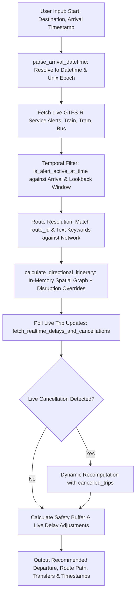

# Technical Specification: PTV GTFS-Realtime Departure Calculator

## Overview
`ptv_realtime.py` is the live API integration and orchestration utility that fetches GTFS-Realtime (GTFS-R) data from Transport Victoria. Given a user's **Start Location**, **Destination Location**, and **Target Arrival Time / Timestamp**, it queries live PTV Service Alerts and Trip Updates, filters disruptions to **only those active during the journey's time window and affecting the transit corridor**, and computes the optimal **Recommended Departure Time** using `directional_routing.py`.

Its production-facing surface - `parse_arrival_datetime`, `fetch_live_service_alerts`, and `fetch_realtime_delays_and_cancellations` - is imported directly by `server/routes/routing.py` and `server/routes/disruptions.py`. The CLI below (`calculate_recommended_departure`, `parse_cli_args`, the `__main__` block) is a manual/offline driver for the same module, not a separate test harness.

---

## Architectural Dataflow & Disruption Ingestion Pipeline



---

## Live Service Alerts Endpoints (Transport Victoria API)

The module connects to the official PTV GTFS-Realtime Protobuf feeds using the `KeyID` header:

| Transit Mode | Feed URL Resource |
| :--- | :--- |
| **Metro Train Trip Updates** | `.../download/gtfsr_metro_train_trip_updates.pb` |
| **Metro Train Service Alerts** | `.../download/gtfsr_metro_train_service_alerts.pb` |
| **Metro Tram Service Alerts** | `.../download/gtfsr_metro_tram_service_alerts.pb` |
| **Metro Bus Service Alerts** | `.../download/gtfsr_metro_bus_service_alerts.pb` |
| **Regional Train Service Alerts** | `.../download/gtfsr_regional_train_service_alerts.pb` |

---

## Timing Window & Route Disruption Filtering

Disruptions are filtered using a two-stage evaluation:

### 1. Temporal Window Filter (`is_alert_active_at_time`)
For each alert with `active_period` list of `[start_timestamp, end_timestamp]`:
- **Journey Window**: $[T_{\text{arrival}} - 120\text{ mins}, T_{\text{arrival}}]$.
- **Future Disruption**: If $\text{start} > T_{\text{arrival}}$, the disruption has not started yet $\rightarrow$ **Ignored**.
- **Past Disruption**: If $\text{end} < T_{\text{window\_start}}$ (and $\text{end} > 0$), the disruption has already concluded $\rightarrow$ **Ignored**.
- **Active Disruption**: If $\text{start} \le T_{\text{arrival}}$ and $(\text{end} = 0 \text{ or } \text{end} \ge T_{\text{window\_start}})$, the disruption is active $\rightarrow$ **Included**.

### 2. Corridor & Route Entity Resolution (`resolve_route_name_from_id`)
- Matches `informed_entity.route_id` against SQLite `routes` table to map GTFS IDs (e.g. `2-FS-`, `1-SAN-`) to line names (e.g. "Frankston", "Sandringham").
- Scans `header_text` and `description_text` for Melbourne metropolitan line names and keywords (e.g. "Replacement Bus", "Buses Replace").

---

## Arrival Time & Timestamp Support

`parse_arrival_datetime` supports four input representations:
1. **24-Hour Time (`HH:MM`)**: Assumes today (or tomorrow if time is earlier than current time).
2. **ISO Date & Time (`YYYY-MM-DD HH:MM` or `YYYY-MM-DDTHH:MM:SS`)**: Explicit date-time anchor.
3. **Unix Epoch Timestamp (`int` / `float` or numeric string)**: Exact second-level Unix timestamp (e.g. `1787219700`).
4. **`datetime` Object**: Direct Python datetime instance.

---

## CLI Options & Usage

```bash
# ISO Date & Time
python ptv_realtime/ptv_realtime.py --start "Richmond" --destination "Footscray" --arrival-time "2026-08-20 09:15" --buffer 10

# Unix Epoch Timestamp
python ptv_realtime/ptv_realtime.py --start "Richmond" --destination "Footscray" --arrival-timestamp 1787219700 --buffer 10

# Simulated Route Cancellation with Replacement Bus Preference
python ptv_realtime/ptv_realtime.py --start "Richmond" --destination "Footscray" --arrival-time "09:15" --disrupt-route "Sandringham"

# Simulated Route Cancellation with Rail Detour Mode (No Replacement Bus)
python ptv_realtime/ptv_realtime.py --start "Richmond" --destination "Footscray" --arrival-time "09:15" --disrupt-route "Sandringham" --no-replacement-bus

# Offline / Skip Live Alerts Fetch
python ptv_realtime/ptv_realtime.py --start "Richmond" --destination "Footscray" --arrival-time "09:15" --no-live-alerts
```
