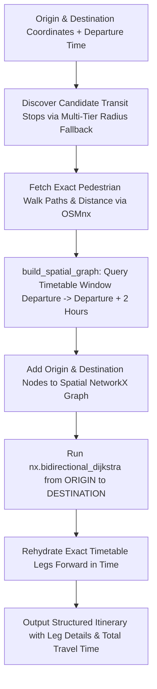

# Technical Specification: Forward Multi-Modal Routing Engine

## Overview
`routing_engine.py` is a forward-chronological (departure-time-driven) transit routing engine that integrates OpenStreetMap (OSMnx) pedestrian network topologies with static GTFS transit schedules. 

Given an **Origin coordinate**, **Destination coordinate**, and a **Desired Departure Time**, the engine constructs a spatial NetworkX graph, calculates exact pedestrian walking paths via OpenStreetMap, searches for optimal multi-modal routes using Bi-directional Dijkstra, and rehydrates forward timetable connections.

---

## Architectural Workflow



---

## Comparison: `routing_engine.py` vs. `directional_routing.py`

| Capability | `routing_engine.py` (This Module) | `directional_routing.py` |
| :--- | :--- | :--- |
| **Planning Direction** | **Forward** (From Departure Time forward) | **Backward** (From Target Arrival Time backward) |
| **Input Format** | Latitude / Longitude numeric coordinates | Addresses / Station Names with Hybrid Geocoder |
| **Pedestrian Routing** | **Live OSMnx Network Analysis** with road network topology | Haversine + Precomputed Transfer Spatial Graph |
| **Disruption Handling** | Baseline GTFS static schedule | **Dynamic in-memory disruptions & replacement buses** |
| **Transit Graph Source**| Dynamic SQL query for active 2-hour departure window | Precomputed indexed tables (`transit_network_edges`) |
| **Primary Use Case** | Immediate "Depart Now" route navigation | Commute planning with guaranteed arrival deadlines |

---

## Core Functions & API Reference

### 1. `calculate_itinerary(...)`
Computes an end-to-end forward multi-modal route.

```python
def calculate_itinerary(
    origin_lat: float, 
    origin_lon: float, 
    dest_lat: float, 
    dest_lon: float, 
    departure_dt: datetime, 
    db_path: str = DB_NAME
) -> dict
```

#### Parameters
| Parameter | Type | Default | Description |
| :--- | :--- | :--- | :--- |
| `origin_lat` | `float` | *Required* | Origin latitude |
| `origin_lon` | `float` | *Required* | Origin longitude |
| `dest_lat` | `float` | *Required* | Destination latitude |
| `dest_lon` | `float` | *Required* | Destination longitude |
| `departure_dt` | `datetime` | *Required* | Earliest departure timestamp |
| `db_path` | `str` | `'gtfs_schedule.db'` | Path to SQLite GTFS database |

#### Return Schema
```json
{
  "status": "Success",
  "total_travel_time_mins": 36,
  "legs": [
    {
      "type": "WALK",
      "instruction": "Walk 0.35km to Melbourne Central Station",
      "duration_mins": 4,
      "start_time": "07:45",
      "end_time": "07:49"
    },
    {
      "type": "TRANSIT",
      "mode": "Train",
      "route": "Sandringham",
      "instruction": "Take Train Sandringham from Melbourne Central Station to Richmond Station",
      "duration_mins": 8,
      "start_time": "07:52",
      "end_time": "08:00",
      "trip_id": "9876.T0.2-SAN-..."
    }
  ]
}
```

---

### 2. `get_nearby_stops(conn, lat, lon)`
Finds candidate transit stops around a point using an expanding radius search:
1. **500m** radius $\rightarrow$ returns matches if found.
2. **1.0km** radius $\rightarrow$ returns matches if found.
3. **1.5km** radius $\rightarrow$ returns matches if found.
4. **2.0km** radius $\rightarrow$ returns matches if found.
5. **Absolute Fallback**: Returns the single closest stop in the entire database.

---

### 3. `get_osmnx_walking_stats(lat1, lon1, lat2, lon2)`
Calculates true walkable road distance and pedestrian routing duration:
1. Constructs a pedestrian network graph using `osmnx.graph_from_point` centered between origin and stop.
2. Identifies nearest walkable network nodes via `ox.distance.nearest_nodes`.
3. Computes exact graph shortest path using `nx.shortest_path_length(..., weight='length')`.
4. **Resilience Fallback**: If OSMnx download or network query fails, automatically falls back to Haversine great-circle distance.

---

### 4. `build_spatial_graph(conn, origin_lat, origin_lon, dest_lat, dest_lon, start_secs, end_secs)`
- Establishes a spatial bounding box ($\pm 0.05^\circ$ around origin and destination).
- Queries `stop_times`, `trips`, and `routes` for consecutive stop connections departing between `start_secs` and `end_secs` (default: 2-hour forward window).
- Computes average edge weights in minutes.
- Synthesizes transfer walk edges between transit stops within $500\text{m}$.

---

### 5. `get_exact_transit_leg(conn, start_stop_id, end_stop_id, departure_time_secs, window_secs=7200)`
Finds the earliest arriving transit trip departing on or after `departure_time_secs`:
```sql
SELECT 
    st1.trip_id, 
    r.route_short_name,
    r.route_type,
    st1.departure_time_secs, 
    st2.arrival_time_secs
FROM stop_times st1
JOIN stop_times st2 ON st1.trip_id = st2.trip_id
JOIN trips t ON st1.trip_id = t.trip_id
JOIN routes r ON t.route_id = r.route_id
WHERE st1.stop_id = ?
  AND st2.stop_id = ?
  AND st1.stop_sequence < st2.stop_sequence
  AND st1.departure_time_secs >= ?
  AND st1.departure_time_secs <= ?
ORDER BY st2.arrival_time_secs ASC
LIMIT 1;
```

---

## Performance & Optimization Notes
- **OSMnx Caching**: `ox.settings.use_cache = True` is enabled to cache OpenStreetMap XML/JSON overpass queries locally.
- **Bounding Box Pruning**: Restricting SQLite transit edge aggregation to the spatial corridor avoids scanning unrelated statewide transit routes.
